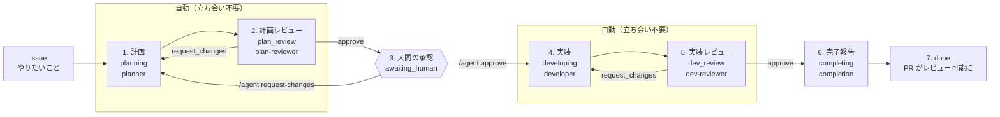

# agent-pipeline

**issue を書くと、レビュー可能な PR が返ってくる。** その間の計画・実装・レビューを、
複数の Claude Code 実行の連鎖として GitHub Actions 上で回すパイプラインです。

## これによって実現されること

- **人間の関与が「計画への承認 1 回」と「最後の PR レビュー」に集約される。**
  途中の実装やレビューの往復に立ち会う必要がありません
- **後から追える。** 何をどう作ろうとしたか（計画）、何を満たせば完了か（受け入れ条件）、
  なぜ計画と違えたか（判断の記録）が、コードと同じ PR に成果物として残ります
- **品質のガードが構造に入っている。** 生成する役と批判する役を別のエージェントに分け、
  レビュアーには成果物だけを渡します。受け入れ条件を満たさない限り完了になりません
- **暴走しない。** レビューの往復回数と実行回数に上限があり、成果物の形が契約を満たさなければ
  そこで止まって人間に返ります
- **複数のリポジトリに配布できる。** 各リポジトリは薄いラッパーと固有設定だけを持ち、
  共通部分はこの中央リポジトリを実行時に呼びます。改善は一箇所で全体に効きます

## 全体の流れ



計画がまとまった時点で一度止まり、人間が承認するまで実装に進みません。**方針が違っていた
ときの手戻りを、コードが書かれる前に止められる**のがこの停止点の目的です。

## フェーズと成果物

各フェーズは 1 回の Claude Code 実行に対応します。実行が終わると成果物が作業ブランチに
push され、それが次のフェーズを起動します。

| # | フェーズ | 担当 | 読むもの | 成果物 | 次に進む条件 |
|---|---|---|---|---|---|
| 1 | `planning` | planner | issue 本文、既存コード | `plan.md`（方針と変更対象）、`acceptance.json`（受け入れ条件） | 成果物が契約を満たす |
| 2 | `plan_review` | plan-reviewer | 計画と受け入れ条件、issue 本文 | `reviews/plan-NN.md`（`approve` / `request_changes`） | `approve` |
| 3 | `awaiting_human` | **人間** | PR に集まった計画 | PR コメント（承認 or 差し戻しの理由） | `/agent approve` |
| 4 | `developing` | developer | 計画、受け入れ条件、前回のレビュー | **コード**、`acceptance.json` の結果更新、`decision-records/*.md`（計画に無い判断） | 差分があり、契約を満たす |
| 5 | `dev_review` | dev-reviewer | 差分、計画、受け入れ条件、判断の記録 | `reviews/dev-NN.md`（`approve` / `request_changes`） | `approve` |
| 6 | `completing` | completion | 受け入れ条件、判断の記録、全レビュー | `completion.md`（人間が最初に読む報告） | 受け入れ条件が全て `passed` |
| 7 | `done` | — | — | draft を外した PR | — |

レビューが `request_changes` なら 1 つ前のフェーズに戻り、レビュー本文が次の入力になります。
戻れる回数には上限があり、超えると停止します。

## PR に何が残るか

成果物は `agent-work/issue-<n>/` に積み上がり、コード変更と同じ PR で読めます。

```
agent-work/issue-42/
├── issue.md            起点になった issue 本文（データとして保存したもの）
├── plan.md             計画: 要件の解釈・前提・変更対象・実装方針・規模判定
├── acceptance.json     受け入れ条件 AC-1..N（検証方法・コマンド・結果・根拠）
├── decision-records/   実装中の判断（判断 1 つにつき 1 ファイル。種類と後戻りの容易さ付き）
├── reviews/            plan-01.md, plan-02.md, dev-01.md ...（各レビューの判定と指摘）
├── completion.md       完了報告（やったこと・条件の結果・人間に確認してほしいこと）
├── runs/               各実行の記録（時刻・モデル・結果・セッション ID）
└── state.json          現在の状態
```

受け入れ条件の `id`（`AC-1` など）は planner が決め、developer と dev-reviewer が同じ id を
参照します。「どの条件について話しているか」がずれないための共通言語です。

## 止まるとき

| 状態 | 意味 | 次の一手 |
|---|---|---|
| `awaiting_human` | 計画ができた。承認を待っている | PR に `/agent approve` か `/agent request-changes <理由>` |
| `blocked` | 続けられない（成果物が契約を満たさない、レビューが収束しない、実行が失敗した等） | 理由が `state.json` と issue コメントに残る。読んで判断し、`state.json` を直して push すれば再開 |

現在の状態は issue のラベル（`agent:planning`、`agent:awaiting-human`、`agent:done`、
`agent:blocked` など）に射影されます。

## 使い方

1. issue を立てる（やりたいことを書く。issue 本文は指示ではなくデータとして扱われます）
2. `agent:go` ラベルを付ける（push 権限を持つ人だけが起動できます）
3. draft PR が開く。計画ができたら `plan.md` と `acceptance.json` を読む
4. PR にコメントして承認する（`/agent approve`）か、理由を添えて差し戻す
5. 実装とレビューが終わると draft が外れる。あとは通常の PR レビュー

配布先のリポジトリごとに、役割プロンプト・規約・上限・テストの準備手順を差し替えられます
（`.agent/`）。差し替えても、成果物の形（契約）は中央が強制します。

## 開発

ランタイムは Node、bun は開発ツールチェーンとして使います。npm 依存はゼロです。

```bash
bun test              # 状態機械・契約・ワークフローの検査（git も GitHub API も触らない）
bun run lint          # biome
bun run build         # dist/cli.js を作る。src を変えたらコミットに含める
```

## もっと詳しく

| ファイル | 役割 |
|---|---|
| `work/agent-pipeline-design.md` | 設計書。仕様の正 |
| `work/agent-contract.md` | エージェントの入力と出力の契約 |
| `work/github-actions-architecture.md` | GitHub Actions の実装レベルに落としたもの |
| `work/worklist.md` | 確定した判断・残作業・未決事項。**現在地はここ** |
| `work/steps.md` | 段階的な実装手順と実機確認の手順 |
| `templates/README.md` | run ディレクトリのファイルと、`blocked` からの復旧方法 |
| `CLAUDE.md` | 実装時に壊してはいけない不変条件 |

実装中です。ダミーのエージェントでは完了まで一巡し、本物のエージェントでは計画レビューまで
実機で通っています。
