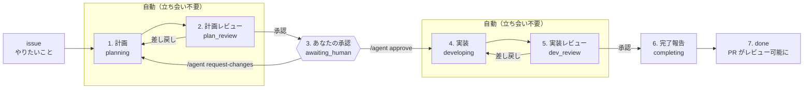

# agent-pipeline とは

**issue を書くと、レビュー可能な PR が返ってくる。** その間の計画・実装・レビューを、
複数の Claude Code 実行の連鎖として GitHub Actions 上で回すパイプラインです。

## これによって実現されること

- **あなたの関与が「計画への承認 1 回」と「最後の PR レビュー」に集約されます。**
  途中の実装やレビューの往復に立ち会う必要がありません
- **後から追えます。** 何をどう作ろうとしたか（計画）、何を満たせば完了か（受け入れ条件）、
  なぜ計画と違えたか（判断の記録）が、コードと同じ PR に残ります
- **品質のガードが構造に入っています。** 作る役と批判する役を別のエージェントに分け、
  レビューする側には成果物だけを渡します。受け入れ条件を満たさない限り完了になりません
- **暴走しません。** レビューの往復回数と実行回数に上限があり、成果物が決められた形式を
  満たさなければ、そこで止まってあなたに返ります
- **一箇所の改善が全リポジトリに効きます。** 各リポジトリに置くのはワークフロー 1 枚と
  固有の設定だけで、共通部分は実行時に agent-pipeline 本体を読みます

## 言葉

このドキュメントで繰り返し出てくる言葉です。

| 言葉 | 意味 |
|---|---|
| フェーズ | 計画・計画レビュー・実装…という進行の段階。エージェントが担当するフェーズは、1 つが 1 回の Claude Code 実行にあたります |
| エージェント | 各フェーズを担当する Claude Code。役割ごとにプロンプトが分かれています |
| 作業ブランチ | パイプラインが作る `claude/issue-<n>` ブランチ。ここへの push が次のフェーズを起動します |
| 作業ディレクトリ | 作業ブランチ上の `agent-work/issue-<n>/`。計画・受け入れ条件・レビューなどの成果物が積み上がります |
| 受け入れ条件 | 「何を満たせば完了か」を `AC-1`, `AC-2`… という id で並べたもの（`acceptance.json`） |
| agent-pipeline 本体 | このパイプラインの実体があるリポジトリ。あなたのリポジトリは実行時にここを呼びます |

フェーズには 3 系統の名前が出てきます。混乱したらこの対応表を見てください。

| 呼び方 | 計画 | 計画レビュー | 承認待ち | 実装 | 実装レビュー | 完了報告 | 完了 |
|---|---|---|---|---|---|---|---|
| フェーズ名 | `planning` | `plan_review` | `awaiting_human` | `developing` | `dev_review` | `completing` | `done` |
| 担当 | planner | plan-reviewer | **あなた** | developer | dev-reviewer | completion | — |
| issue のラベル | `agent:planning` | `agent:plan-review` | `agent:awaiting-human` | `agent:developing` | `agent:dev-review` | `agent:completing` | `agent:done` |

## 全体の流れ



計画がまとまった時点で一度止まり、あなたが承認するまで実装に進みません。**方針が違っていた
ときの手戻りを、コードが書かれる前に止められる**のがこの停止点の目的です。

## フェーズと成果物

各フェーズが終わると成果物が作業ブランチに push され、それが次のフェーズを起動します。

| # | フェーズ | 読むもの | 成果物 | 次に進む条件 |
|---|---|---|---|---|
| 1 | 計画 | issue 本文、既存コード | `plan.md`（方針と変更対象）、`acceptance.json`（受け入れ条件） | 成果物が決められた形式を満たす |
| 2 | 計画レビュー | 計画と受け入れ条件、issue 本文 | `reviews/plan-NN.md`（承認 / 差し戻し） | 承認 |
| 3 | 承認待ち | PR に集まった計画 | PR コメント（承認、または差し戻しの理由） | あなたの `/agent approve` |
| 4 | 実装 | 計画、受け入れ条件、前回のレビュー | **コード**、`acceptance.json` の結果更新、`decision-records.jsonl`（計画に無い判断） | 差分があり、形式を満たす |
| 5 | 実装レビュー | 差分、計画、受け入れ条件、判断の記録 | `reviews/dev-NN.md`（承認 / 差し戻し） | 承認 |
| 6 | 完了報告 | 受け入れ条件、判断の記録、全レビュー | `completion.md`（レビューする人が最初に読む報告） | 受け入れ条件が全て `passed` |
| 7 | 完了 | — | draft を外した PR | — |

レビューが差し戻しなら 1 つ前のフェーズに戻り、レビュー本文が次の入力になります。
戻れる回数には上限（既定 5 往復）があり、超えると停止します。

## PR に何が残るか

成果物は作業ディレクトリに積み上がり、コード変更と同じ PR で読めます。

```
agent-work/issue-42/
├── issue.md            起点になった issue 本文（データとして保存したもの）
├── plan.md             計画: 要件の解釈・前提・変更対象・実装方針・規模判定
├── acceptance.json     受け入れ条件 AC-1..N（検証方法・コマンド・結果・根拠）
├── decision-records.jsonl  実装中の判断（1 行 1 件。後戻りの容易さ付き）
├── reviews/            plan-01.md, plan-02.md, dev-01.md ...（各レビューの判定と指摘）
├── completion.md       完了報告（やったこと・条件の結果・確認してほしいこと）
├── runs/               各実行の記録（時刻・モデル・結果・セッション ID）
└── state.json          現在の状態
```

受け入れ条件の id（`AC-1` など）は planner が決め、developer と dev-reviewer が同じ id を
参照します。「どの条件について話しているか」がずれないための共通言語です。

## 使い方

1. issue を立てる（やりたいことを書く。issue 本文は指示ではなくデータとして扱われます）
2. `agent:go` ラベルを付ける（push 権限を持つ人だけが起動できます）
3. draft PR が開きます。計画ができたら `plan.md` と `acceptance.json` を読む
4. その PR にコメントする
   - `/agent approve` — 計画を承認して実装に進む
   - `/agent request-changes <理由>` — 計画を差し戻す。理由がレビューとして残り、次の計画に反映されます
5. 実装とレビューが終わると draft が外れます。あとは通常の PR レビュー

途中で止まったときも、**理由と次の手順がその PR にコメントされます。** 原因を直して
`/agent retry` とコメントすれば、直前のフェーズからやり直します。

承認と差し戻しは **PR 側のコメント**だけで受け付けます（issue 側のコメントは見ていません）。
人が見る対象——計画・受け入れ条件・レビュー・コード——がすべて PR に集まるためです。

## 止まるとき

| 状態 | 意味 | 次の一手 |
|---|---|---|
| `awaiting_human` | 計画ができた。あなたの承認を待っている | PR に `/agent approve` か `/agent request-changes <理由>` |
| `blocked` | 続けられない（成果物が形式を満たさない、レビューが収束しない、実行が失敗した等） | **理由と手順が PR にコメントされます。** 原因を直して `/agent retry` → [troubleshooting.md](troubleshooting.md) |

現在の状態は issue のラベルに出ます（上の対応表）。`blocked` のときは Actions の run も
赤くなるので、一覧からも気付けます。

受け入れ条件のうち `verification: manual` のものは、あなたが確かめます。その場合も
「何を確かめ、`acceptance.json` のどこをどう直し、そのあと何をするか」が PR コメントに出ます。

## 次に読むもの

| 文書 | 内容 |
|---|---|
| [installation.md](installation.md) | あなたのリポジトリへの導入手順 |
| [customize-prompt.md](customize-prompt.md) | エージェントの振る舞いを変える |
| [troubleshooting.md](troubleshooting.md) | 止まったとき・思ったとおりに動かないとき |
